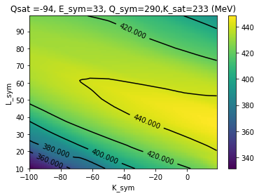
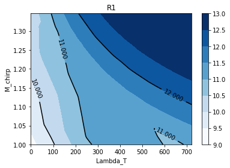
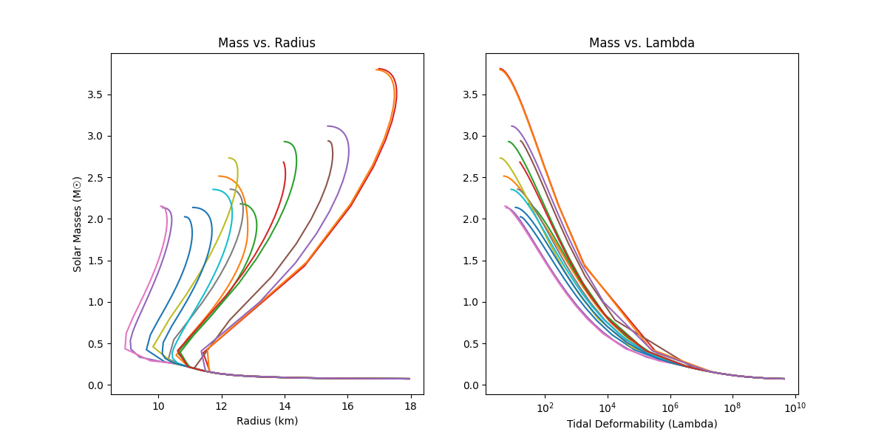

# BIC - Tidal Deformation of Neutron stars

Note: This work was done between 09/2019 and 08/2020, as part of an **undergraduate Research Grant**, under the supervision of Dr. [Márcio Ferreira](https://cfisuc.fis.uc.pt/people.php?oid=175621) and Dr. [Constança Providência](https://cfisuc.fis.uc.pt/people.php?oid=5038490), both distinguished figures in the field of neutron star astrophysics.

This research seeks to uncover the internal composition of neutron stars by bridging the gap between theoretical models and astronomical observations. By generating a vast dataset of potential **Equations of State** (EoS), one can derive the macroscopic properties (such as mass and radius) by solving the **Tolman-Oppenheimer-Volkoff** (TOV) equations.

Because neutron stars subject matter to extreme pressures and temperatures unattainable on Earth, they serve as unique cosmic laboratories. Comparing my calculated models against real-world observational data allows us to constrain the behavior of dense matter and search for evidence of exotic particles or phase transitions.

Source: Astromaterial Science and Nuclear Pasta, M. E. Caplan, C. J. Horowitz

# Outputs

## Binary systems of neutron stars - Machine Learning approach

### Tidal deformation:

    

### Radius, Chirp Mass and Tidal Deformation
The $M_{chirp}$ of a two-body system can be expressed as:  $M_{chirp} = \frac{(m_1 m_2)^{3/5}}{(m_1 + m_2)^{1/5}}$

    

## Solving TOV Equation from a Neutron Star EoS

Mass-radius relation and lambda-mass relation of a neutron star

    

## Running locally

### Environment

- Create python virtual environment:  `python -m venv .venv`

- Activate environment: `.venv\Scripts\activate.bat`

- Install requirements: `pip install -r requirements.txt`
